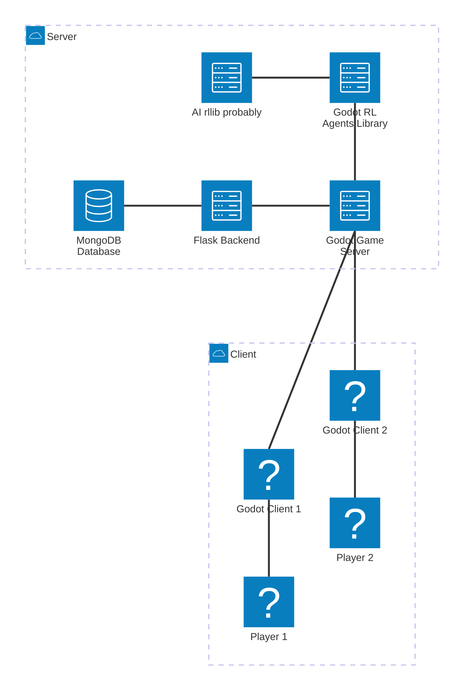

# Ballistics

```mermaid
architecture-beta
    group server(cloud)[Server]
    group client(cloud)[Client]

    service db(database)[MongoDB Database] in server
    %% service disk1(disk)[Storage] in server
    service bserver(server)[Flask Backend] in server
    service gserver(server)[Godot Game Server] in server
    service gai(server)[Godot RL Agents Library] in server
    service ai(server)[AI rllib probably] in server

    bserver:L -- R:db
    gserver:L -- R:bserver
    gai:B -- T:gserver
    ai:R -- L:gai

    service player1(player)[Player 1] in client
    service gclient1(phone)[Godot Client 1] in client
    service player2(player)[Player 2] in client
    service gclient2(phone)[Godot Client 2] in client

    player1:T -- B:gclient1
    player2:T -- B:gclient2

    gclient1:T -- B:gserver
    gclient2:T -- B:gserver

```
