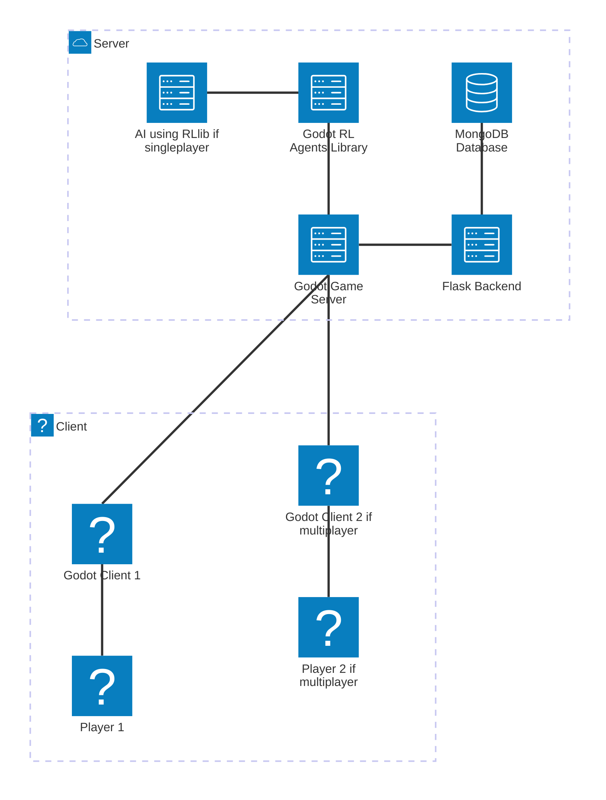

## Architecture Diagram

```mermaid
architecture-beta
    group server(cloud)[Server]
    group client(mdi:computer)[Client]

    service db(database)[MongoDB Database] in server
    %% service disk1(disk)[Storage] in server
    service bserver(server)[Flask Backend] in server
    service gserver(server)[Godot Game Server] in server
    service gai(server)[Godot RL Agents Library] in server
    service ai(server)[AI using RLlib if singleplayer] in server

    bserver:T -- B:db
    bserver:L -- R:gserver
    gai:B -- T:gserver
    ai:R -- L:gai

    service player1(mdi:person)[Player 1] in client
    service gclient1(mdi:mobile-phone)[Godot Client 1] in client
    service player2(mdi:person)[Player 2 if multiplayer] in client
    service gclient2(mdi:mobile-phone)[Godot Client 2 if multiplayer] in client

    player1:T -- B:gclient1
    player2:T -- B:gclient2

    gclient1:T -- B:gserver
    gclient2:T -- B:gserver
```
